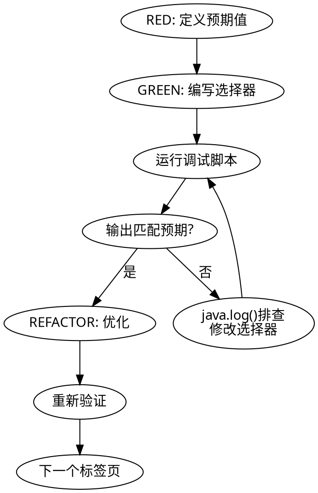

# Legado 书源创建（TDD 驱动）

通过「定义预期 → 编写规则 → 调试验证」的 TDD 循环创建书源规则。

## 铁律

**每个标签页必须通过 TDD 循环才能进入下一个。未验证的规则就是错误的规则。**

**No exceptions:**
- 不要跳过"定义预期"直接写选择器
- 不要跳过调试"因为选择器看起来对了"
- 不要跳过调试"因为网页结构很简单"
- 不要跳过调试"因为上一个标签页通过了"
- 不要跳过调试"因为网络超时"——检查网络/代理/请求头，等待重试
- 不要批量写完所有规则再调试——每个标签页单独验证
- 不要调试失败后直接改选择器——先用 `java.log()` 排查

**违反字面规则就是违反精神规则。**

## TDD 循环



## 工作流

### Phase 0: 初始化

```
cp /home/simon/legado-sigma/template.yaml ./booksource/书源名.yaml
```

填写基础信息：
- `bookSourceName`: 目标网站名称
- `bookSourceUrl`: 目标网站域名（含 http/https）
- `bookSourceType`: 书源类型（0=文本, 1=音频, 3=文件, 4=视频）

**注意**：不要删除 YAML 中的字段，空字符串 `""` 表示待填写。

填写完基础信息后，询问用户接下来要填写：搜索页、发现页、或两者都填。

### Phase 1-N: 每个标签页的 TDD 循环

标签页顺序：搜索/发现 → 详情 → 目录 → 正文

每个标签页严格按以下循环执行：

#### 🔴 RED: 定义预期

用 `chrome-devtools_take_snapshot` 查看目标网页，找到一本具体书籍，**在编写任何选择器之前**，记录预期提取结果：

| 字段 | 预期值 |
|------|--------|
| name | 斗破苍穹 |
| author | 天蚕土豆 |
| bookUrl | https://m.qidian.com/book/... |
| ... | ... |

**没有预期值就不写选择器。** 这是 TDD 的核心。

#### 🟢 GREEN: 编写规则并验证

1. 将选择器写入 YAML 对应字段
2. 运行调试脚本：

```bash
python3 scripts/legado-debug.py --host <手机IP> --source ~/booksource/书源名.yaml --key "<调试内容>" -q
```

`--key` 格式：

| 类型 | 格式 | 示例 |
|------|------|------|
| 搜索 | 关键字 | `"系统"` |
| 发现 | `分类名::URL` | `"月票榜::https://...?page={{page}}"` |
| 详情 | URL | `"https://m.qidian.com/book/1015609210"` |
| 目录 | `++URL` | `"++https://.../read/30394"` |
| 正文 | `--URL` | `"--https://.../chapter/30394/20940996"` |

3. **检查退出码**：`0` = 成功，`1` = 失败
4. **对比输出与预期值**

**不匹配时**：用 `<js>java.log(result);</js>` 打印上下文数据结构，确认数据结构后再针对性修改选择器。**禁止盲目修改选择器。**

#### 🔵 REFACTOR: 优化

- 检查选择器是否可以简化
- 检查是否需要处理边界情况（缺失字段、编码问题）
- 重新调试确认优化后仍然通过

### Final: 保存书源

所有标签页调试通过后：

```bash
python3 scripts/legado-debug.py --host <手机IP> --source ~/booksource/书源名.yaml --save-only
```

## 合理化借口 vs 现实

| 借口 | 现实 |
|------|------|
| "选择器看起来对了" | 看起来对 ≠ 实际对。调试只需30秒。 |
| "网页结构很简单" | 简单页面也有动态加载、编码问题。 |
| "上一个标签页通过了" | 每个标签页的 HTML 结构不同。 |
| "网络超时了" | 检查网络/代理/请求头，等待重试。 |
| "我会手动测试" | 手动测试 ≠ TDD 验证。调试脚本更可靠。 |
| "我直接写完所有规则再调试" | 批量调试无法定位哪个规则出错。 |
| "调试太慢了" | 调试30秒 vs 修复错误30分钟。 |
| "这个标签页不重要" | 每个标签页都影响书源功能。 |

## 🚩 红旗 — 停下来调试

- 写了选择器但没运行调试脚本
- 跳过"定义预期"步骤直接写选择器
- 调试失败后直接改选择器而不先用 `java.log()` 排查
- 网络超时后跳过调试
- 所有标签页写完才第一次调试
- 没有记录预期值就开始写规则

**以上任何一条出现 = STOP. 运行调试脚本。验证输出。**

## 速查表

### 常见问题

| 问题 | 解决 |
|------|------|
| String.replace 歧义 | `String(obj).replace(...)` |
| 选择器无效 | 检查 HTML 实际结构 |
| 调试无响应 | 手机锁屏，提醒用户解锁 |
| 搜索不到 | 请求头加 charset |
| 表单清空 | 点击「拉取源」恢复 |

### 调试脚本

```bash
python3 scripts/legado-debug.py --host <手机IP> --source <书源文件路径> --key "<调试内容>"
```

`--source` 支持 `.json`、`.yaml`、`.yml` 格式。不指定 `--key` 时自动从 `ruleSearch.checkKeyWord` 提取，为空则默认 `"我的"`。

退出码：`0` = 成功，`1` = 失败。加 `-q` 静默模式。

完整参数、示例、输出解读见 `scripts/README.md`。

## 按需加载

| 场景 | 加载文件 |
|------|----------|
| 写 JS 规则/复杂选择器 | `references/syntax.md` |
| 写发现页（JSON格式/按钮/交互） | `references/discovery.md` |
| 过验证盾（Cloudflare等） | `references/advanced.md` |
| java 对象方法/内置变量 | `references/jsHelp.md` |
| 规则标志/登录UI/并发等 | `references/ruleHelp.md` |
| legado-debug.py脚本疑问 | `scripts/README.md` |