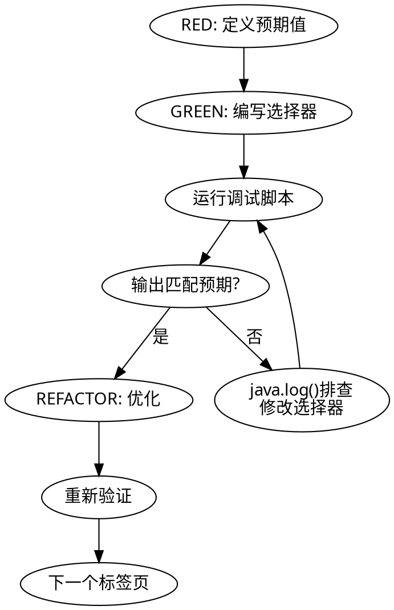

# Legado 书源创建（TDD 驱动）

通过「定义预期 → 编写规则 → 调试验证」的 TDD 循环创建书源规则。

## 铁律

**每个标签页必须通过 TDD 循环才能进入下一个。未验证的规则就是错误的规则。**

**No exceptions:**
- 不要跳过"定义预期"直接写选择器
- 不要跳过调试"因为选择器看起来对了"
- 不要跳过调试"因为网页结构很简单"
- 不要跳过调试"因为上一个标签页通过了"
- 不要跳过调试"因为网络超时"——检查网络/代理/请求头，等待重试
- 不要批量写完所有规则再调试——每个标签页单独验证
- 不要调试失败后直接改选择器——先用 `java.log()` 排查

**违反字面规则就是违反精神规则。**

## TDD 循环


```dot
digraph tdd {
  rankdir=TB;
  node [fontname="sans-serif"];
  "RED: 定义预期值" -> "GREEN: 编写选择器";
  "GREEN: 编写选择器" -> "运行调试脚本";
  "运行调试脚本" -> "输出匹配预期?";
  "输出匹配预期?" -> "java.log()排查\n修改选择器" [label="否"];
  "java.log()排查\n修改选择器" -> "运行调试脚本";
  "输出匹配预期?" -> "REFACTOR: 优化" [label="是"];
  "REFACTOR: 优化" -> "重新验证";
  "重新验证" -> "下一个标签页";
}
```

## 工作流

### Phase 0: 初始化

在当前工作目录下，将 `./references/template.yaml` 复制到当前目录下并更名为 `<书源名>.yaml`。

在开始写规则/运行调试脚本之前，先向用户询问其 `<手机IP>`（用于 `--host <手机IP>`），并确认手机与本机同一网络且手机端 Legado 允许访问/调试。

阅读`./references/basics.md`，然后填写模板基础信息：
- `bookSourceName`
- `bookSourceUrl`
- `bookSourceType`

**注意**：不要删除 YAML 中的字段，空字符串 `""` 表示待填写。


### Phase 1-N: 每个标签页的 TDD 循环

标签页顺序：搜索 → 发现 → 详情 → 目录 → 正文

每个标签页严格按以下循环执行：

#### 🔴 RED: 定义预期

获取目标网页的 HTML（优先：使用提供的网页读取方式，例如网页读取工具或 `curl`；若无法访问，请请求用户提供该页面 URL 与 HTML 源码/片段）。找到一本具体书籍，**在编写任何选择器之前**，记录预期提取结果：

| 字段 | 预期值 |
|------|--------|
| name | 斗破苍穹 |
| author | 天蚕土豆 |
| bookUrl | https://m.qidian.com/book/... |
| ... | ... |

**没有预期值就不写选择器**：先补齐预期值再写选择器。

#### 🟢 GREEN: 编写规则并验证

1. 将选择器写入 YAML 对应字段（仅在该字段已有预期值时）
2. 根据正在编写的标签页对应地运行调试脚本，注意调试脚本会受各种因素影响导致执行时间较长，调用时应按情况设置超时时间在15-60秒之间：

**必须传入 `--phase` 参数**：搜索=1，发现=2，详情=3，目录=4，正文=5。

```bash
python3 scripts/legado-debug.py --host <手机IP> --source ./书源名.yaml --key="<调试内容>" --phase <阶段序号>
```

**STOP**：若脚本未能正常执行（命令不存在/依赖缺失/连接失败/超时/无法访问 `<手机IP>`），这是环境/网络问题：先排查网络/代理/请求头/手机端状态，必要时请求用户检查手机端 Legado 是否可用。

`--key` 格式：

| 类型 | 格式 | 示例 |
|------|------|------|
| 搜索 | 关键字 | `"系统"` |
| 发现 | `分类名::URL` | `"月票榜::https://...?page={{page}}"` |
| 详情 | URL | `"https://m.qidian.com/book/1015609210"` |
| 目录 | `++URL` | `"++https://.../read/30394"` |
| 正文 | `--URL` | `"--https://.../chapter/30394/20940996"` |

3. **对比输出与预期值**；通过后才进入下一个标签页

**不匹配时**：在 YAML 中对应失败字段的规则表达式里（通常是该字段选择器前面或者末尾，或你使用的 JS 片段/`@js` 写法中）加入 `<js>java.log(result);</js>` 添加调试日志，确认输入输出后再针对性修改选择器。**禁止盲目修改选择器。**

#### 🔵 REFACTOR: 优化

- 使用`<js>java.log(result);</js>`进行调试
- 检查选择器是否可以简化
- 检查是否需要处理边界情况（缺失字段、编码问题）
- 重新调试确认优化后仍然通过

### Final: 保存书源

所有标签页调试通过后：

```bash
python3 scripts/legado-debug.py --host <手机IP> --source ./书源名.yaml --save-only
```

## 合理化借口 vs 现实

| MUST（必须） | MUST NOT（禁止） |
|------|------|
| 每次修改一个标签页/一个字段后，必须运行调试脚本并拿到输出再继续 | 不要因为“选择器看起来对了”就跳过调试 |
| 即使网页结构简单/上一个标签页通过，也必须按本标签页重新验证 | 不要因为“结构简单/上一步通过”就跳过验证 |
| 网络超时/连接失败先当作环境问题处理：检查网络/代理/请求头后重试 | 不要把网络/环境错误当作选择器错误去盲改 |
| 调试脚本失败（退出码 1）先用 `java.log()` 定位再改选择器 | 不要调试失败就直接改选择器 |
| 按标签页逐个完成：搜索 → 发现 → 详情 → 目录 → 正文 | 不要批量写完所有规则再第一次调试 |

## 🚩 红旗 — 停下来调试

- 写了选择器但没运行调试脚本
- 跳过"定义预期"步骤直接写选择器
- 调试失败后直接改选择器而不先用 `java.log()` 排查
- 网络超时后跳过调试
- 所有标签页写完才第一次调试
- 没有记录预期值就开始写规则

**以上任何一条出现 = STOP. 运行调试脚本。验证输出。**

## 速查表

### 常见问题

| 问题 | 解决 |
|------|------|
| String.replace 歧义 | `String(obj).replace(...)` |
| 选择器无效 | 手机端html结构与PC端不符，更换UA/未使用`类型@名称`来提取属性/被反爬拦截（见 references/troubleshoot.md） |
| 调试超时/无响应 | 手机锁屏，提醒用户解锁 |
| 搜索不到 | 请求头加 charset |

### 调试脚本

```bash
python3 scripts/legado-debug.py --host <手机IP> --source <书源文件路径> --key="<调试内容>" --phase <阶段序号>
```

`--source` 支持 `.json`、`.yaml`、`.yml` 格式。不指定 `--key` 时自动从 `ruleSearch.checkKeyWord` 提取，为空则默认 `"我的"`。

退出码：`0` = 成功，`1` = 失败。

完整参数、示例、输出解读见 `scripts/README.md`。

## 按需加载

| 场景 | 加载文件 |
|------|----------|
| 写发现页（JSON格式/按钮/交互） | `references/discovery.md` |
| 规则写了但获取不到内容（更换UA/反爬/webView/webJs/CF盾/字体/图片解密） | `references/troubleshoot.md` |
| 登录/回调/按钮交互 | `references/login.md` |
| JS API与URL选项参考（java.*/book/chapter/cookie/cache） | `references/js-api.md` |
| 漫画书源（正文规则/加密解密/防盗链） | `references/comic.md` |
| 多模式书源（线路分流/小说漫画等多类型书源） | `references/multi.md` |
| 调试脚本使用 | `scripts/README.md` |
